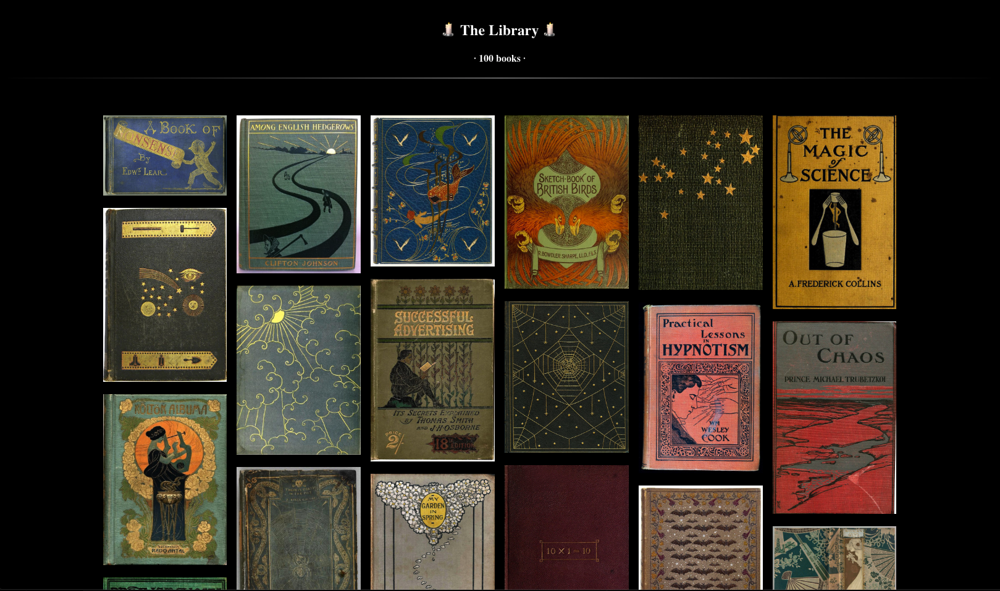

# NIGHTSTAND
### A Minimalist Reader for Scanned Books (And More)



Books are enjoyable---when they look right. I've used some
pretty decent ePub and PDF apps, but something was always
lacking in all the apps I tried for scanned books (jpeg or png format.)

Well, I had enough. I wanted to take a folder filled with images,
and spit out a clean, easy to use webpage that can run on any device.

Easily zoom in with the hidden settings on the top left
corner, and choose between scroll or book layouts.

Not only can you enjoy reading books, but you can share the
experience on your own website. Host a local webserver and read
your books across devices. This tool would be useful
for webcomics, graphic novels, or any projects where you
want to display a series of images you can scroll through.

You can also build a searchable library to browse through a large
catalog.

### Use Cases:

- Books and Book Collections
- Presentations/slideshows
- Art, Portfolios and Galleries
- Comics
- Photo collections
- And more!

## Dependencies

Nightstand used to be a complicated mess, but now runs entirely
on shell scripting. The only dependency is ImageMagick, which turns the first image into a thumbnail in webp format.

Nightstand has only been tested on OSX/Unix, so other platforms
may need some tweaking.

## Quickstart

### Installing

Create a path for "nightstand" in your bashrc or bash profile. Personally, I have a folder that holds all of my scripts, and I use that folder as my path.

```
export PATH="$PATH:$HOME/.scripts"
```
If you installed correctly, running ```nightstand help``` will show the options information.

### Setup

First, you need to make sure your images are named and formatted correctly. I recomend using vim, with vimv or vim renamer to rename images in bulk.

All images should be in .jpg format. The last 4 characters before the extension should be four digits. Nightstand uses the "0001" page for the thumbnail/book cover.

Make sure the containing folder has the right name. Spaces are acceptable, but be careful when using special characters. The name of your folder will be used as the title for the html page.

Everything together, your directory should look something like this:

```
/The Title of Your Book
    BookTitle_0001.jpg
    BookTitle_0002.jpg
    BookTitle_0003.jpg
    BookTitle_0004.jpg
    BookTitle_0005.jpg
    BookTitle_0006.jpg
    BookTitle_0007.jpg
    BookTitle_0008.jpg
    BookTitle_0009.jpg
    BookTitle_0010.jpg
    BookTitle_0011.jpg
    BookTitle_0012.jpg
```

It should also be noted, that the finished html page will look best when all the images are the same size. Images with varying aspect ratios will look pretty ugly.

### Commands

Make sure you've changed to the right directory. ```cd /path/to/my/book/``` Then you can run ```nightstand [option]```

You can run nightstand on individual book folders, or use the other options to set up multiple folders at once. Running these commands multiple times will override existing index.html files and thumbnails.

```
nightstand
```

If you don't enter any option, nightstand will take images in the current directory and build a single index.html file.

```
nightstand bulk
```

The bulk option will go into the subdirectories of the current folder and build a nightstand page in each. This is useful for setting up a whole library without manually running the script in a ton of folders.

```
nightstand library
```

The library option looks in subdirectories for index.html files and thumbnails, and builds a library webpage in the current directory so you can browse through your whole collection.


## Publishing to the Web

Once your webpage is compiled, you can modify the results to
your heart's content.

Simply upload your folder(s) to your webhost, and you're all set.

Be warned: depending on how large your images are, and how
many pages you're compiling, the resulting webpage may be
slow to load. I recommend making sure your images are scaled
and compressed to a reasonable size for a smoother
experience.


## Features for Future Versions

- Improved search
- Metadata options, tagging, and book info
- Click and drag to scroll over images (mobile and desktop)
- Custom background images(?)
- Presentation mode (flip through pages one or two at a time)
- Adjust page brightness and contrast
- Page grid view
- Support for markdown/html eBooks
